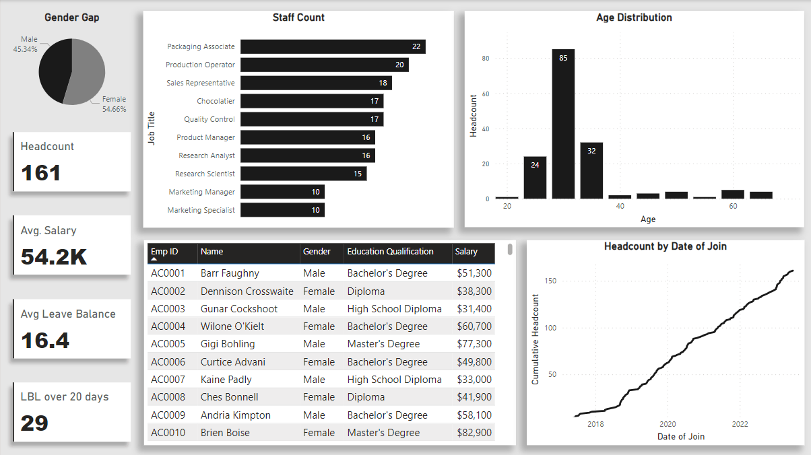
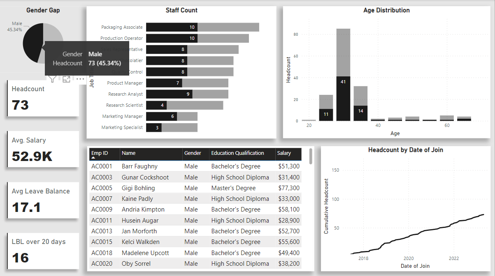
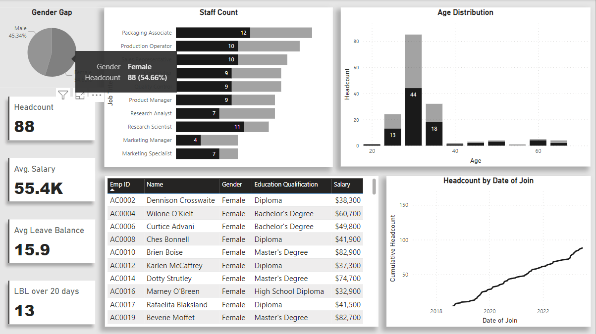
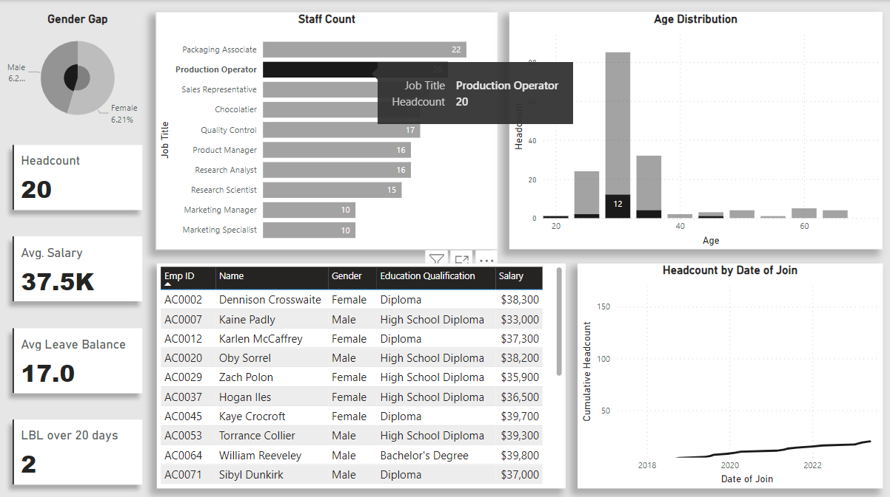
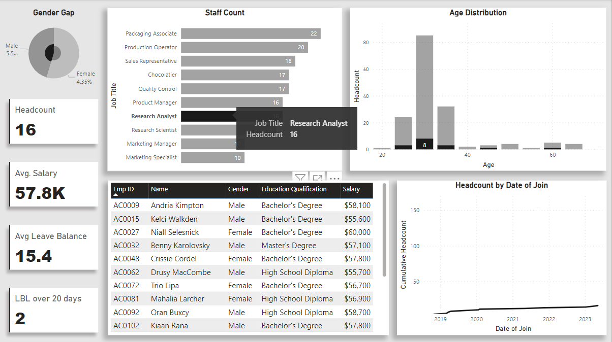
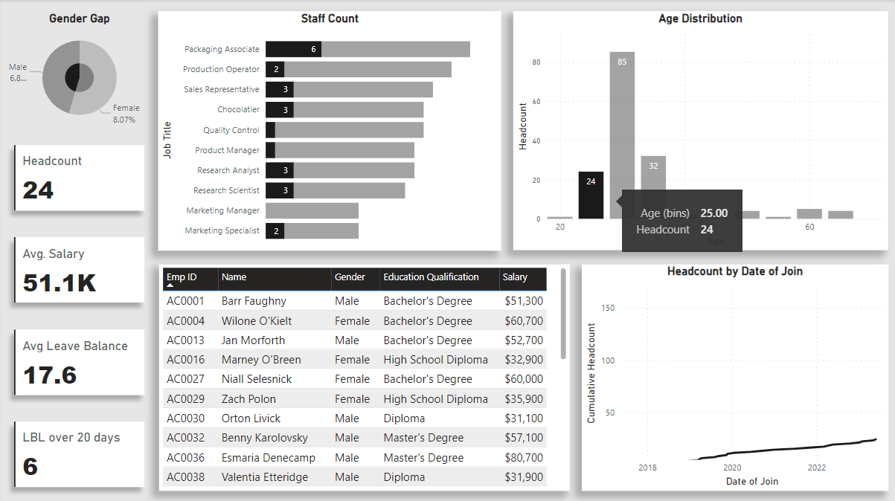
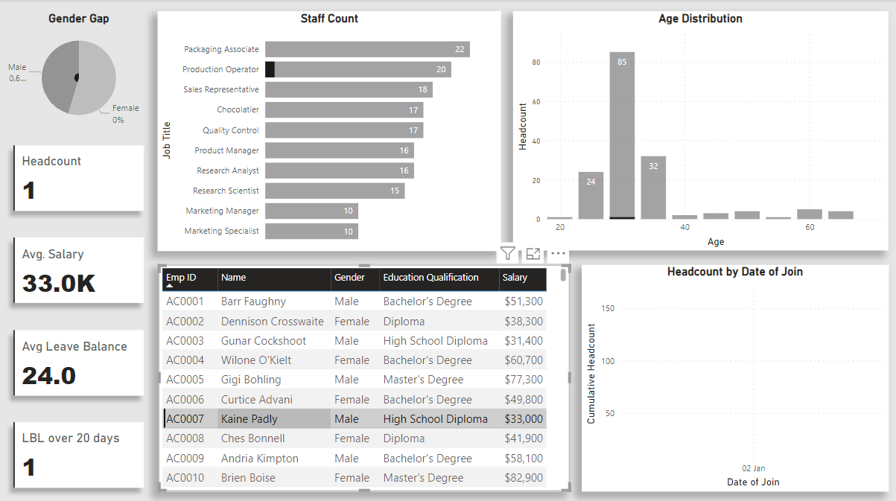
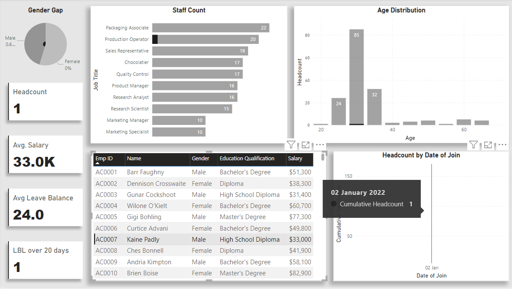

# Project Title: HR Analytics Dashboard - A Power BI Project 📊

The HR Analytics Dashboard project aims to leverage simulated datasets representing diverse facets of a company's human resources activities to develop an insightful Power BI Dashboard. The primary objective is to showcase proficiency in cleansing, analyzing, transforming, modeling, visualizing, and deriving actionable insights from HR-related data using Power BI.

## Data Sources 📂🔢
The dataset used for this project comprises an Excel workbook containing comprehensive employee information vital for human resources management. It includes essential details such as:

- **Employee Names:** Identifies individuals within the organization.
- **Employee IDs:** Unique identification numbers assigned to each employee.
- **Gender:** Demographic information reflecting the gender distribution within the workforce.
- **Salary:** Details of employee salaries
**Educational Qualification:** Provides insights into the educational background and qualifications of employees
- **Date of Joining:** Records the dates when employees joined the organization, providing insights into tenure and recruitment trends.
- **Leave Balance:** Quantifies the available leave entitlements for each employee, facilitating analysis of leave utilization and workforce management.

This rich repository of data serves as the foundation for analyzing workforce dynamics, tracking employee tenure, gender distribution, and leave utilization patterns. With this dataset, the project aims to delve into HR analytics, leveraging Power BI to visualize trends, uncover insights, and derive actionable recommendations for optimizing human capital management strategies within the organization.

## Installation Instructions ⚙️📥
Clone the repository

Install Power BI Desktop from the official website: Power BI Desktop

Open Power BI Desktop and navigate to "Open" > "File" and select the project file (.pbix) from the cloned repository.

Explore the dashboard, interact with visualizations, and gain insights from the data. 📊🔍

## Features 🛠️📊
This repository includes the following features for effective data analysis and visualization using Power BI:

**Data Exploration & Understanding**: Explore and gain insights into the data through various techniques such as data profiling, summary statistics, and exploratory data analysis. 📈🔎

**Data Transformation**: Apply data transformation techniques using DAX including filtering, grouping, and aggregation to reshape and prepare the data for analysis. 🔄🔀

**Visualization Design**: Design visually appealing and informative visualizations using a wide range of chart types, colours, and formatting options to effectively communicate the insights hidden in the data. 🎨📊

**Dashboard Development**: Develop interactive and user-friendly dashboards that provide a comprehensive view of the data, allowing users to explore and interact with the visualizations. 📲🖥️

**Insights**: Derive actionable insights from the data analysis and visualization, providing meaningful recommendations and decision-making support for stakeholders. 💡🔍

This repository is designed to facilitate efficient data analysis workflows, from data exploration and cleaning to modelling, transformation, and visualization, resulting in impactful and insightful Power BI dashboards.

## Dashboard 📸📸

The HR Analytics Dashboard features a refined monochromatic design, ensuring visual consistency and clarity with a single color palette. This minimalist approach allows users to focus on key HR metrics and insights without distractions, promoting ease of use and accessibility. With its sleek presentation, the dashboard empowers HR professionals with actionable insights for informed decision-making and strategic initiatives within the organization.

### Gender Analysis

### Job Title - Production Operator

### Job Title - Research Analyst

### Employees between the age of 20-25

### Information about the Employee named Kaine Padly

### Date of Joining of Kaine Padly

## Technologies Used 💻🔧
Microsoft Power BI

Microsoft Excel

Microsoft Power Query

DAX

## HR Analytics Dashboard Demo 💻

This HR Analytics Dashboard was created with assistance from the video linked above.

*Video Credit: [Chandoo](https://www.youtube.com/@chandoo_)*

